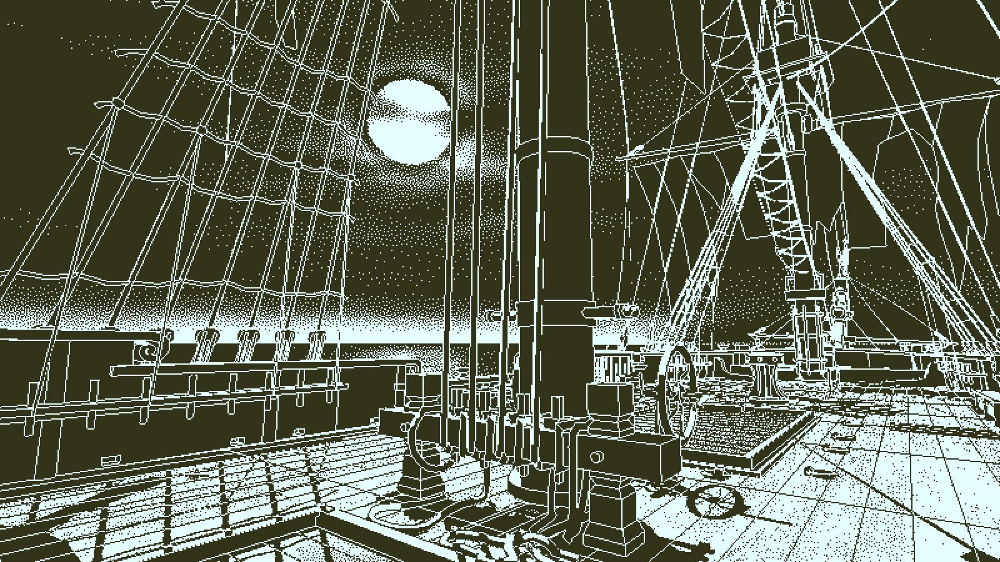
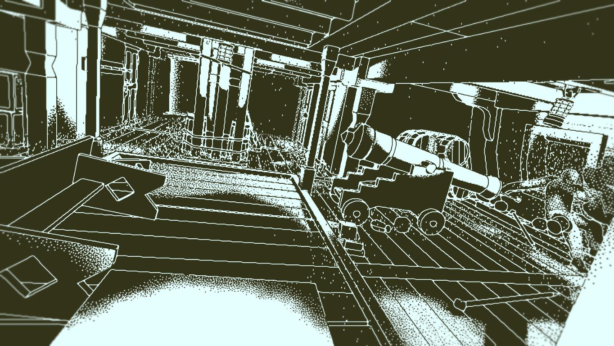
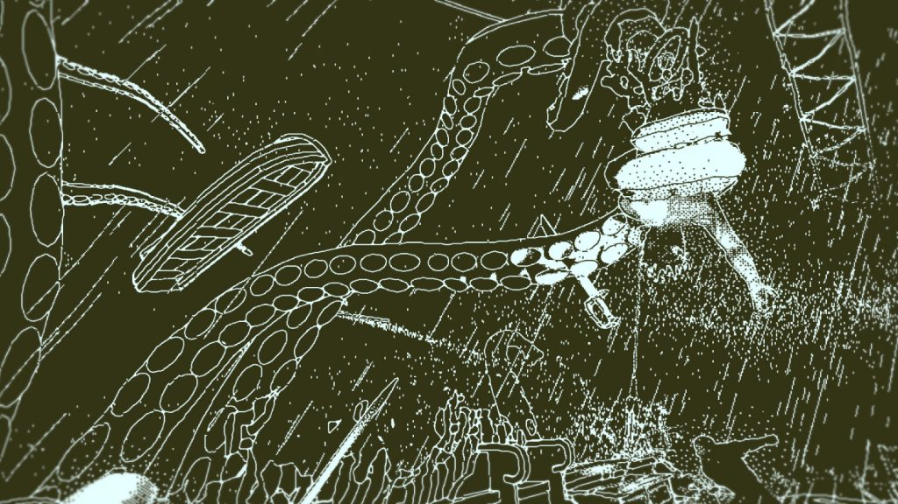

Nu am fost niciodată un as al puzzle-urilor sau al genului adventure. Nu jucam jocuri din sfera asta când eram mic și nici nu eram vreun mare împătimit al rezolvatului de mistere. De fapt, când am început sa joc adventure mă simțeam nevoit să mă folosesc de walkthroughs frecvent, dintr-o stranie teamă de a mă confrunta cu problemele. De-a lungul timpului am căpătat, în schimb, o adevărată pasiune pentru explorare și mistere și am devenit tot mai însetat de aventuri. Return of the Obra Dinn vine ca un punct culminant al genului, construit pe logică pură, menit să îmi satisfacă această plăcere. Nu știam la ce să mă aștept când l-am deschis. Nu citisem vreun review înainte, doar văzusem câteva imagini și totul părea învăluit în mister. Așa că am descoperit în Obra Dinn ceva unic.

Creat de Lucas Pope, omul din spatele lăudatului Papers, Please, RotOD este munca unui om care caută în permanență să inoveze și care nu se culcă pe proprii săi lauri. Dar, spre deosebire de Papers, aș spune că în Obra Dinn Pope reușește să aducă și niște poezie.

Totul începe cu tine pus în pielea unui inspector de asigurări trimis pentru a evalua pagubele de pe nava Obra Dinn, care a părăsit Anglia cu destinația Orient, dar s-a întors într-un mod misterios, înainte de a-și încheia călătoria, și cu echipajul dispărut. Acțiunea are loc în a doua jumătate a secolului al XIX-lea iar misiunea ta este să descoperi soarta fiecărui membru. Cu un total 45 de oameni, trebuie să oferi un raport concludent despre ce s-a întâmplat cu fiecare, ca la final să faci un calcul cât mai corect al daunelor. Îți este înmânat un ceas magic, gravat cu un craniu, care poate da timpul înapoi la momentul morții fiecărui individ, punând momentul la care asiști într-un stop cadru. Auzi câteodată doar câteva dialoguri laconice, alteori poate nici atât. Din ele, alături de multe alte elemente, vei încerca să scoți cât mai multe informații. Cine vorbește, limba în care se vorbește șamd. Desigur, în unele cazuri este destul de ușor să îți dai seama cine spune ce, câteodată nu e chiar atât de simplu.

Încă de când pui piciorul pe navă ești întâmpinat de primul cadavru și cu trecerea din amintire în amintire tot mai multe oase bătute de soare vor începe să apară  și locuri noi ți se vor descoperi. De altfel, aș spune că nava devine un personaj în sine, unul misterios care își dezvăluie cu greu secretele și în măruntaiele căreia te vei plimba pentru a rezolva sorții marinarilor pierduți. Nava Obra Dinn prinde viață prin relatările diferiților oameni de la bordul său și prin atenția la detalii cu care a fost realizată, prin peripețiile prin care a trecut.

Povestea este împărțită în 10 capitole, dintre care unul rămâne ascuns până ce dezlegi toate destinele, iar fiecare capitol vine cu aroma lui. Crime, accidente, lupte cu monștrii marini sau răscoale, calătoria pe care o retrăiești este plină de acțiune. Mi-aș fi dorit ca personajele să fie mai bine conturate, totuși. Primești niște schițe cu membrii echipajului iar fețele lor sunt încețoșate. Pe măsură ce afli mai multe despre fiecare, chipurile devin tot mai clare. Dar, din păcate,  rămânem doar cu frânturi despre unii marinari, iar despre alții doar cu niște nume.

D.p.d.v. al gameplay-ului jocul este destul  de simplu, deși poate părea confuz la început. Interfața nu este foarte clară și îți poate lua ceva timp până să te prinzi cum să umbli cu cartea aia. Perspectiva este first person și tot ceea ce vei rezolva o vei face prin logică sau eliminare. Sigur, există câteva cazuri în care ajută și niște cunoștințe de istorie. De exemplu, să știi cum erau îmbrăcați marinarii  din secolul al XIX-lea, în funcție de rang, te poate ajuta să recunoști mai ușor ce sarcini îndeplinesc aceștia la bord. Sau să poți identifica o sabie adusă din Orientul Mijlociu care decorează camera cuiva și astfel să deduci din ce țară e marinarul respectiv.

Puzzle-urile nu sunt neapărat dificile, doar necesită timp și răbdare. Probabil puzzle-ul meu preferat a fost unul în care trebuia să mă prind de către cine din plutonul de execuție a fost împușcat un așa zis trădător, urmând traiectoria balistică a glonțului până la ucigașul cu pricina.
Misterele de pe Obra Dinn nu devin plictisitoare sau anoste, ba chiar aș putea spune că sunt relaxante și oferă evadare din viața cotidiană. Fără un inventar ca jocurile adventure tradiționale, ai doar o carte și un ceas de care te folosești pe parcursul celor 6-7 ore cât durează un playthrough obișnuit. Să rezolvi toate cele 45 de fates te poate face să petreci și până la 12 ore pe Obra Dinn.

Jocul vine cu o grafică originală, având intenția să reproducă estetica jocurilor de pe sistemele MAC din anii 80. Dar nu doar atât, mai există setări grafice menite să readucă la viață și alte sisteme: Zenith, IBM. Fiecare opțiune are farmecul său și reușește să dea jocului parfumul acela de poveste veche, întâmplată cu mult timp în urmă, din care doar legendele au mai rămas. Aș spune totuși că ”look-ul” meu preferat rămâne cel Macintosh, din simplul motiv că nuanța aceea verzuie mi-a dat un vibe lovecraftian, mai ales în capitolul în care echipajul se confruntă cu un monstru tentaculat. Dar creatorul jocului a reușit să plăsmuiască adevărate momente de poezie, tablouri macabre blocate în timp, cum ar fi echipajul aflat în luptă cu un kraken de proporții imense. Toată această imagine, cu groaza întipărită pe fețele unora, fermitatea pe ale altora este parcă scoasă dintr-o ilustrație din cărțile cu pirați.

Muzica apare doar în amintirile prin care te perinzi și rezonează destul de bine cu evenimentele la care iei parte. O confruntare cu creaturile va genera automat o melodie ceva mai antrenantă și plină de adrenalină, începutul unei revolte va da naștere unor piese mai tensionate și mai triste, etc. De altfel sunetul este o componentă esențială care face toată aventura să pară una organică. Astfel fiecare pas pe care îl faci va fi urmat de scârțâitul lemnului sau va fi amuțit de răgetul furtunii de pe mare.

În concluzie, Return of the Obra Dinn nu este un adventure pe care îl pot compara cu altele. Abundă în originalitate și îi va oferi multe ore plăcute jucătorului răbdător, care vrea să fie cât mai minuțios și privește toată experiența ca pe una meditativă. Îl recomand cu căldură celor care vor o experiență de-a detectivul făcută cum trebuie. Dacă m-ar pune cineva să dau exemple de jocuri pe care le consider opere de artă, RotOD ar fi unul dintre acestea. O sinestezie în care logica triumfă, Obra Dinn reprezintă  jocul atât intelectualizat cât și distractiv. ■
