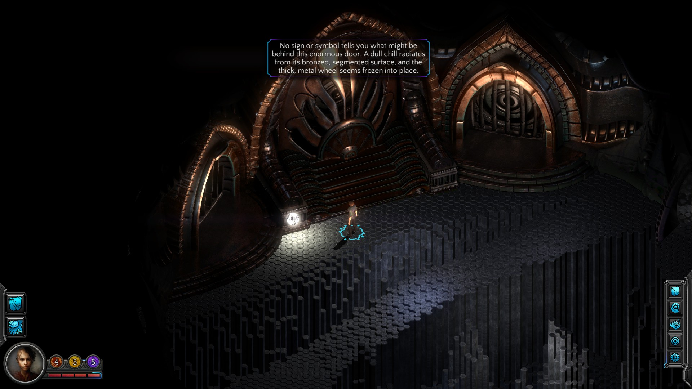
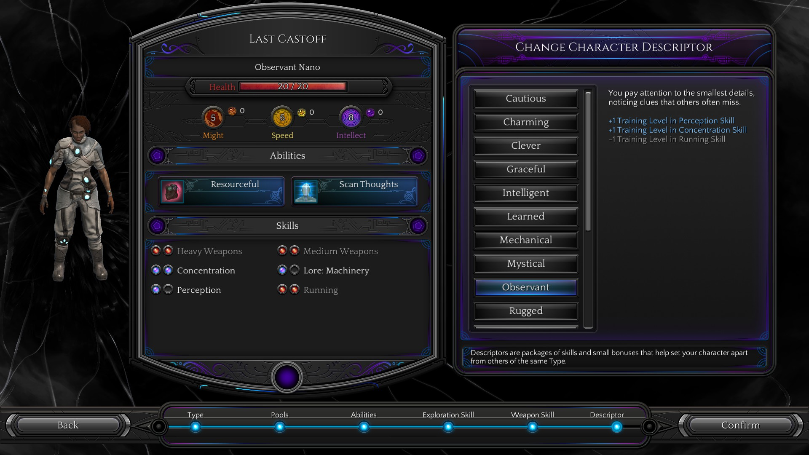
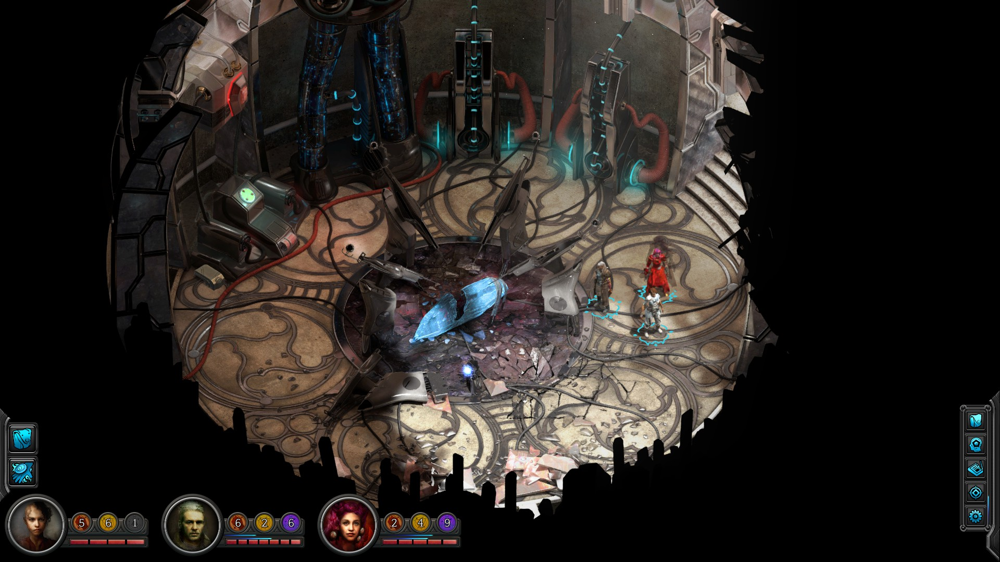
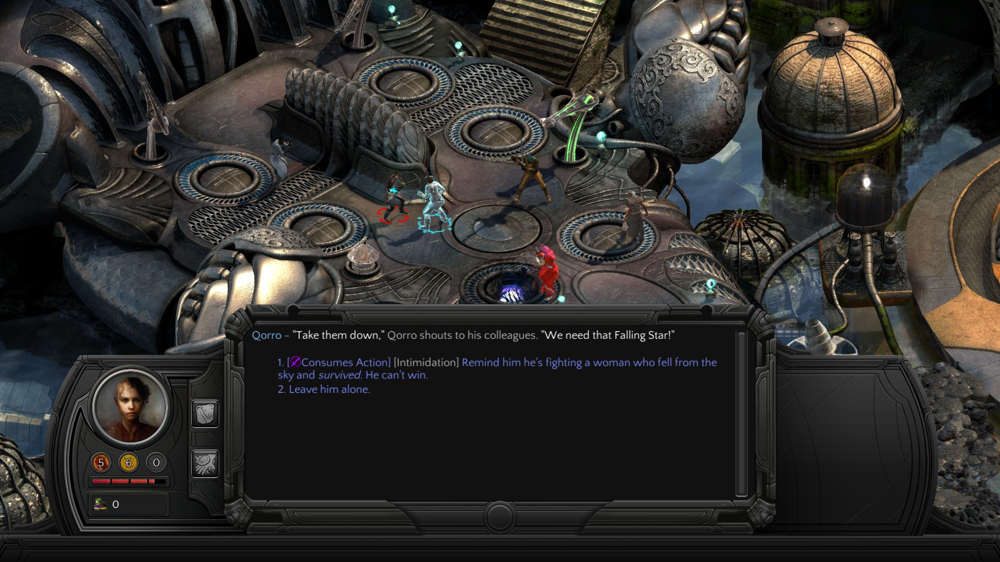
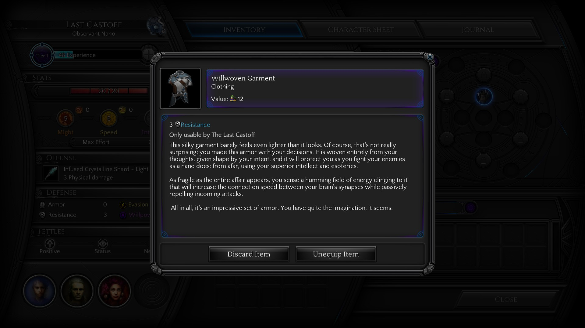

Iată că mai sunt două săptămâni până la lansarea lui Torment: Tides of Numenera. După aproape patru ani în development, ultimul dintre “greii” din primul val de jocuri Kickstarter este în sfârșit gata. Fiind unul dintre backeri, am avut ocazia să pun mâna pe versiunea beta a jocului, în care am putut juca primul act. Mai jos sunt câteva dintre impresiile mele, sub forma unui preview. Aș vrea să pot da vina pe tipografie pentru publicarea lui atât de târzie - în curând ar trebui să apară primele reviewuri - dar adevărul e că mi-a fost doar lene să mă ocup de el.

Pentru început trebuie făcută o precizare pentru cei care nu sunt în temă: legătura lui T:ToN cu Planescape: Torment este una pur “spirituală”. Poveștile și lumile din cele două jocuri nu sunt legate în mod direct. Setting-ul Planescape nu a putut fi folosit din motive care țin de licențiere, așa că noul joc are loc în universul Numenera, descris într-un sistem de pen’n’paper fără legătură cu regulile AD&D. Mai precis, este vorba de un așa numit The Ninth World, o lume cu un miliard de ani în viitor față de noi. Opt mari civilizații au crescut și decăzut una pe ruinele celeilalte, lăsând în urmă rămășițe numite numenera - artefacte de tehnologii uitate, acum vecine cu magia. Estetica generală este una apropiată de Planescape: un fantasy atipic, cu elemente bizare sci-fi având un destul de pronunțat punk vibe. În afară de asta, în povestea din Numenera se reiau câteva motive și teme familiare, iar ocazional se ivește câte un easter egg care-ți face șiret cu ochiul. Dar să nu anticipăm.

După primele 10 minute în Torment: Tides of Numenera, devine evident că avem de-a face cu un joc care se pliază pe componenta de bază a predecesorului său, deopotrivă lăudată și criticată: mult, mult text. O mulțime de interacțiuni sunt descrise în maniera la care mă așteptam, cu lux de amănunte în cadrul ferestrei de dialog. Totodată, în aceste prime 10 minute apare și prima distincție față de Planescape. Jocul începe cu ceea ce se dovedește în scurt timp a fi o secvență de definire a personajului, sub forma unor “teste”. Modul în care le rezolvi îți determină clasa. Posibilitățile de definire a personajului sunt din start mai numeroase și mai libere. Dacă vă amintiți, în Planescape sistemul de alegere a clasei era destul de stângaci implementat - începeai mereu ca fighter iar ulterior anumite NPC-uri te puteau respecializa în mage sau thief, moment în care pierdeai tot xp-ul acumulat până atunci.

Clasele disponibile acum sunt tot în număr de trei și oglindesc aceleași abordări: glaive, jack și nano, adică mai pe înțelesul nostru fighter, rogue și mage. În plus, trebuie alese abilități și skill-uri, deopotrivă exploratorii, conversaționale sau de combat. Un skill care mi s-a părut interesant este cel care îți dă posibilitatea să citești gândurile interlocutorului - adaugă o nouă dimensiune în conversații, dar în schimb alegerea lui de la început te lasă fără un potențial skill util de combat. Într-un final, trebuie ales descriptor-ul, un fel de background trait care îți particularizează puțin personajul. De exemplu poți alege să fii un Clever Jack, adică un Jack care are niște bonusuri la skill-urile de decepție și persuasiune (și o penalizare la chestiile tocilărești, precum lore). Sau poți să fii un Mechanical Glaive, priceput la reparat și mânuit mașinării, dar mai puțin carismatic. Descriptorii disponibili sunt suficient de mulți, dar în afară de boost-ul inițial în direcția dorită de dezvoltare nu cred că afectează semnificativ parcursul jocului.

E timpul să oftăm colectiv. Ziceam că T:ToN reia o parte din trope-urile predecesorului. Ei bine, primul dintre ele este că joci IAR rolul unui amnezic. Sort of. Recuperarea amintirilor este din nou un procedeu narativ important, cu un șpil - cele mai multe dintre ele nu sunt amintirile tale. Protagonistul este un așa numit Castoff - un avatar al unui zeu cu multe fețe, abandonat de spiritul său când nu i-ai mai fost de folos. O dată ce spiritul zeului ți-a părăsit trupul, ai dobândit o conștiință nouă, independentă și buimacă. Ca un făcut, nici n-apuci bine să întrebi cine ești și ce cauți acolo, că o prezență malefică îți vrea deja capul.

O dată încheiată secțiunea introductivă, ești aruncat pe străzile din Sagus Cliffs, o fostă capitală a unui vechi imperiu. Din acest moment, spiritul lui Planescape: Torment își face simțită prezența tot mai puternic. Un sentiment confortabil de familiaritate te învăluie, deși nimic din ce întâlnești nu ai mai văzut deja în Planescape. Jocul se desfășoară însă în același fel: de fiecare dată când intri într-o zonă nouă e ca și cum ai deschide o cutie cu bomboane. Iei NPC-urile la întrebări și quest-urile încep să curgă fără număr. Unde nu capeți quest, dai cu siguranță de o conversație zemoasă, cu lore în abundență sau doar cu simple ciudățenii “de atmosferă”. Feeling-ul general al orașului mi-a amintit de Lower/Clerk Ward, zonele mai curățele din Sigil.

Ceva lipsește față de predecesorul său ilustru. Nu mai ești întrerupt de lupte plictisitoare cu trash mobs. În cele 6-7 ore pe care le-am jucat, nu mi-a fost dat să parcurg nicio zonă sau dungeon care trebuia curățat de carcalaci. O singură dată am intrat în combat, ore bune de joc mai târziu. A fost destul de confuz și am mâncat bătaie. Dând reload, am descoperit că o puteam evita cu succes (și mai multă satisfacție) folosindu-mă de dialog. Bănuiala mea e că o să fie posibil să parcurgi jocul în întregime cu foarte puțin, sau chiar deloc combat.

De dragul preview-ului, am început un joc nou și am ajuns din nou la un moment cu combat opțional. În mod normal aș fi evitat-o destul de ușor folosindu-mă de o minciunică strecurată cu Deception skill. Aceste momente, când lucrurile se precipită în direcția unei lupte, se numesc “crize” în Torment. Cum spuneam, dacă ești dibaci la vorbă poți trece ușor peste o “criză”. Altfel, ești aruncat într-un tradițional mod de combat pe ture. O particularitate pe care am remarcat-o este posibilitatea de a aplica un bonus de “efort” la atacurile tale. În funcție de tipul atacului, poți alege să consumi niște puncte dintr-un pool de strength, agility sau intelligence și să îți augmentezi astfel atacul. Dar ceea ce mi s-a părut interesant la aceste “crize” este faptul că, o dată ce au fost inițiate, nu ești obligat să te lupți până la capăt, ci ai și alte opțiuni de a rezolva conflictul. În exemplul pe care l-am încercat, am avut posibilitatea de a (re)iniția dialogul în timpul luptei. Astfel, cu niște puncte în Intimidation, îți poți descuraja inamicul și să-l convingi să o lase baltă, că n-are nicio șansă. Am ratat acest check, dar am mai avut opțiunea de a manipula un element din decor - le-am băgat niște raze în ochi care i-au dezorientat și demoralizat. Apoi am luat un critical hit de la unul dintre ei și am murit. Dar asta nu a însemnat game over: am revenit de pe lumea de dincolo ca să-i găsesc pe dușmani speriați de învierea mea nenaturală. Îmi aduseseră trupul la șeful lor, iar acesta, mai cu capul pe umeri, a văzut talente nebănuite în mine și mi-a oferit un quest.

Producătorii au încercat așadar să introducă o doză sănătoasă de neliniaritate. Dacă și restul luptelor vor fi la fel de atent “craftate”, eu mă voi declara mulțumit, deși, personal, aș fi și mai fericit dacă voi putea trece prin joc fără să vărs sânge deloc. Îmi surâde foarte mult ideea unui joc pur adventure, în aceeași perspectivă izometrică, cu o lume mare și ciudată de explorat și îmi pare rău că nu a fost exploatată până acum de nimeni cu adevărat.

Revenind la non-combat, regăsim aceeași mecanică cu “efortul” și în dialoguri și diversele interacțiuni cu lumea din joc. De exemplu, dacă vrei să fii sigur că decepția ta va avea 100% succes, poți consuma un punct din pool-ul de intellect, augmentându-ți astfel skill check-ul. Aceste pool-uri au însă un număr limitat de puncte și se regenerează doar folosind anumite consumabile sau după ce te odihnești. Până acum nu am avut probleme, dar mă aștept ca mai târziu în joc să fie nevoie să drămuiesc mai bine punctele.

Trebuie să mărturisesc acum că m-a cam luat gura pe dinainte când am delimitat categoric lumea din T:ToN față de cea din Planescape. În decursul porțiunii de beta la care am participat am dat peste nu chiar puține trimiteri și clins d’oeil la predecesor. Unele sunt mai subtile, cum ar fi un segment cu dialoguri lungi, în urma căruia trebuie să soluționezi un mister, moment care mi-a amintit de Bordelul Plăcerilor Intelectuale din primul joc. Altele sunt mai pe față, cum ar fi menționarea numelui lui Adahn în conversații - o glumiță cam răsuflată, prezentă în toate rpg-urile indie ieșite în ultimii ani. A, și fără să intru în detalii spoilerifice, la un moment dat o să vă întâlniți cu un NPC din jocul original. Unul minor, dar memorabil. Nu zic nu, mi-au descrețit fruntea aceste momente, dar sper, pentru binele jocului, să nu se fi exagerat în rest cu ele. Altfel se poate aluneca mult prea ușor în auto-parodie și e păcat.

Așadar, varianta beta a jocului m-a lăsat un optimist ușor îngrijorat. Pare că punctele forte ale predecesorului au fost preluate în T:ToN. În plus, avem un combat ceva mai bine pus la punct, dar care putea la fel de bine să lipsească, din punctul meu de vedere. Avem și câteva inovații la sistemul de dialoguri - avem skill-uri orientate pe acest stil de joc, precum și check-uri mai dese, care dinamizează puțin conversațiile. Scriitura pare la locul ei, plină de imaginație. Ce mă îngrijorează e posibilitatea transformării într-un “soft reboot”, iar trimiterile la predecesor să degenereze într-o pastișă în toată legea. Varianta beta a fost insuficientă să-mi pot da cu părerea în legătură cu firul principal al poveștii, iar în acesta stă o bună parte din miza jocului. Dacă Torment va reuși să se desprindă suficient de mult de umbra lui Planescape, încât să-și croiască propriul drum, va deveni la rândul său un cult classic. Dacă nu o va face, nu este totul pierdut - mie unuia mi-a făcut plăcere să explorez noile povești pe care jocul mi le-a oferit până acum. Presimt că voi avea parte de câteva seri comfy în compania sa, chiar și dacă nu o să reușească să mă miște la fel de mult cum a făcut-o Planescape la vremea sa. Într-un an care se arată sărac în rpg-uri serioase, ce-ți poți dori mai mult?
