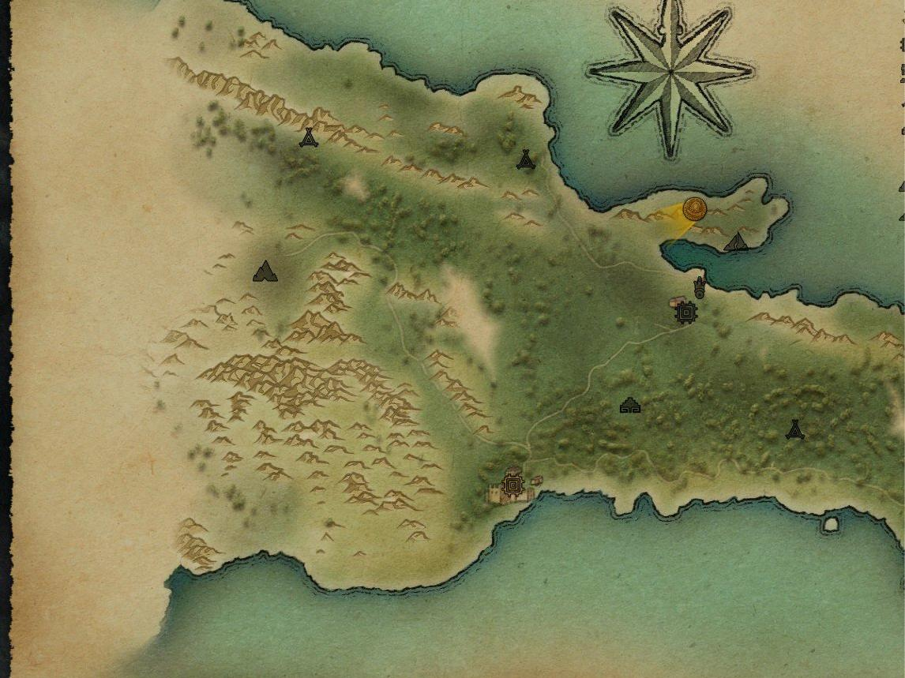

Sparg eu gheața cu niște gânduri despre primul Expeditions, chit că nu e un titlu prea recent și s-a mai scris despre el în Level. Am terminat jocul acum vreo două săptămâni și mi-am notat niște idei pentru că am vrut să îmi compar părerile cu ale lui juve din revistă - un fel de dialog la distanță dacă vreți :) Așadar, ce e scris mai jos nu e tocmai un articol.

De mult nu am mai pus atâta efort și pasiune într-un joc - mi-a luat mai bine de 30 de ore să îl termin - și cred că asta spune multe. Evident, mi-a plăcut, însă aș zice că m-a lăsat cu un gust dulce-amărui.

Expeditions: Conquistador a fost finanțat prin Kickstarter, iar echipa producătoare, Logic Artists, e formată din vreo 10 studenți danezi. În aceste condiții, rezultatul final e mai mult decât satisfăcător. Gameplay-ul e solid, jocul se mișcă bine, nu sunt bug-uri majore, iar cantitatea de conținut e satisfăcătoare. Totuși, din a doua jumătate a jocului am început să am sentimentul că nu primesc chiar atât de multe lucruri noi pe cât aș dori. Acțiunile încep să devină repetitive: explorezi un pic, aduni resurse, faci tabăra și repeți. Din când în când mai apare câte un eveniment aleatoriu, dar de obicei nu sunt foarte interesante, în cel mai bun caz fiind vorba de o luptă. Apoi, mai e partea de questing, dezamăgitoare din punctul meu de vedere. În cele 30 de ore de joc am terminat tot cam atât de multe misiuni. Iar asta nu ar fi fost o problemă dacă acele misiuni ar fi fost mai atractive. E drept, un bonus e faptul că ai la dispoziție mai multe căi de a rezolva quest-urile, pe cale pașnică sau nu.

Un punct de atracție al jocului este partea de squad management. Pornești la drum cu 10 companioni desemnați de tine, la care poți să adaugi pe parcursul poveștii cam încă atâția. Fiecare vine cu un portret frumos desenat și o poveste de fundal. În majoritatea cazurilor însă, cam acestea sunt singurele lor caracteristici distinctive. Personajele nu evoluează și foarte rar afli lucruri noi despre ele. Mai mult, nu există posibilitatea de a comunica direct cu membrii echipei, singurele momente în care poți dialoga cu ei apărând în mod aleatoriu când îți faci tabăra. Aș fi vrut să pot să îi întreb din propria inițiativă ce mai fac, dacă au ceva în minte, dacă sunt supărați sau pur și simplu să aflu mai multe despre ei. Or, măcar acele momente aleatorii - care, de altfel, sunt sarea și piperul taberelor - să fie mai dese. Astfel, la finalul jocului eram cât de cât atașat de vreo 4-5 personaje, restul erau și ei pe acolo.

Nici ecranul de management al trupelor nu excelează. Poți să crești în nivel membrii echipei și să adaugi puncte către cele 6 ”meserii” pe care le pot avea. Pe lângă asta mai poți adăuga așa-numitul echipament, care crește calitatea armelor sau a armurii, însă fără a putea alege efectiv ce piese de echipament poartă fiecare, ca în RPG-urile serioase. E drept, Conquistador e un hibrid între TBS și RPG, dar chiar și așa cred că se putea ceva asemănător cu Spellforce, unde aveam un control destul de mare asupra companionilor. Plus că asta ar fi adus un bonus și părții de comerț, la rândul său foarte schematic realizată.

După cum spuneam mai sus, fiecare personaj (important) are atașat un portret frumos desenat. Unele locații mai de seamă sunt însoțite de asemenea de un peisaj. Și atât! Grafic, jocul e departe de a fi arătos, fără a fi urât. Locațiile sunt însă foarte asemănătoare și nu ies în evidență. În general harta e sărăcăcios construită și nu prea aduce a o junglă luxuriantă. Aș fi sperat să fiu bombardat cu desene, dacă nu pentru personaje, măcar pentru locații. Tabloul creat în minte cu ajutorul descrierii textuale nu e de ajuns pentru a face o locație memorabilă.

O altă bilă neagră e dimensiunea efectivă a lumii de joc. Harta te păcălește spunându-ți că ai un teritoriu uriaș de explorat, când de fapt majoritatea zonelor sunt inaccesibile. În acest fel ești constrâns cumva și nu ai libertatea de a explora după bunul plac. Cred că producătorii au avut în minte un plan de explorare asemănător cu parcurgerea dialogului: ai mai multe direcții în care poți merge și într-o anumită măsură contează pe care o alegi, dar la final ajungi în același loc.

Sosesc acum și la părțile bune. În primul rând, luptele, unul dintre lucrurile ce m-au ținut în fața monitorului. Pe parcursul jocului nu sunt foarte multe bătălii, cred că undeva între 20 și 30, în funcție și de cât de agresiv joci. Cele mai multe oferă însă un scenariu interesant, cu un câmp de bătălie bine construit. Oponenții nu sunt foarte inteligenți, cel puțin pe nivelul mediu de dificultate, însă își fac datoria bine. De remarcat și faptul că iau decizii mai bune sau mai rele în funcție de cât de experimentați sunt. Apoi, datorită faptului că sunt câte 5 clase de trupe atât pentru spanioli cât și pentru nativi, luptele sunt variate. Acțiunile pe care le poți întreprinde sunt diverse, lucru ajutat și de diversele obiecte suplimentare (precum curse sau bombe cu ulei) pe care le poți folosi în bătălie.

Am adus aminte mai sus de nivelul de dificultate și vreau să dau un sfat care poate crește considerabil calitatea experienței de joc: jucați cu cu modul Ironman activat. Astfel, nu veți putea să încărcați o salvare anterioară și să reluați o anumită acțiune. Din păcate, nu am putut să rezist tentației și am reluat jocul de câte ori am simțit că lucrurile nu decurg cum îmi doream. E drept, am vrut să văd cam ce opțiuni îți sunt puse la dispoziție și am fost plăcut surprins să văd că alegerile făcute contează într-o măsură destul de mare. Pe de altă parte am pierdut la capitolul afectiv. Ca să înțelegeți mai bine, o să dau un exemplu. În prima locație din joc, insula Hispaniola (cealaltă e Mexic), primești o misiune de la guvernator să te ocupi de problema unui trib care a ocupat un templu de lângă drumul ce leagă principalele locații spaniole. Guvernatorul consideră ca acest lucru blochează comerțul între cele două zone și te roagă se îl scapi de acei nativi. Ajuns la templu ai opțiunea să vorbești cu nativii sau să îi ataci. Pentru că părea o situație destul de riscantă, inamicii apărând drept niște canibali care puneau capetele mumificate ale victimelor în vârf de lance, am decis să îi atac. În timpul luptei am observat însă că majoritatea inamicilor erau civili înarmați cu cuțite și care efectiv dârdâiau de frică. În alte cuvinte, niște oameni nevinovați. Am încărcat jocul înainte de bătălie și i-am abordat pașnic. Nativii mi-au explicat că era un simplu ritual de amintire a bătrânilor (capetele mumificate) și că aveau să se întoarcă la satele lor în scurt timp. Așadar, nu era nevoie de vărsare de sânge, astfel că tu ai fi devenit monstrul dacă îi omorai. Ah, the feelings!

Povestea per total e relativ interesantă. Din nou, parcă se putea mai mult - era loc de mai mult. Alegerile pe care le faci contează și e chiar și o fărâmă de rejucabilitate, la nivelul de _good guy vs. bad guy_ approach. Scriitura e foarte bună și mi-a făcut plăcere să citesc în nu foarte multele situații când am avut ocazia să o fac. Un lucru demn de menționat e abordarea egalitară din punct de vedere al sexelor. Doar jumătate din personaje sunt bărbați. Mai mult, femeile se luptă și în general au același cuvânt de spus ca și bărbații. Acest lucru e total nerealist pentru acea vreme, însă în contextul actual e o bilă albă, mai ales că știm de la început că jocul se desfășoară într-un univers ușor diferit de cel real.

Îmi pare rău să tot dau în jocul ăsta, pentru că mi-a plăcut. Am înșirat o mulțime de puncte negative, mai multe oricum decât cele pozitive. Totuși, jocul e solid și cred că sentimentele mele față de el sunt asemănătoare cu cele ale unei mame pentru odrasla sa: îl critic și vreau mai mult de la el tocmai pentru că mi-a plăcut. Lăsând la o parte tot ce am spus mai sus, cred că cel mai mare reproș pe care îl am e lipsa unui editor. E drept, de la lansarea jocului producătorii au pus la dispoziția publicului un ”editor de evenimente,” mult prea puțin pentru a putea moda jocul într-un mod semnificativ. Drept rezultat, în acest moment nu există nici măcar o fărâmă de conținut suplimentar. Și când te gândești la ce ar fi putut să facă o comunitate dedicată cu doar câteva unelte! Sper ca următorul joc din serie, Vikings, să nu fie doar o Mărie cu altă pălărie, pentru că atunci lipsa uneltelor de modare pentru Conquistador ar fi un mare dick move din partea producătorilor.

Așadar, indiferent de ce am spus mai sus, jocul e bun și merită jucat.

P.S.: Revin la ideea privitoare la gradul de dificultate și modul Ironman. Am (re)citit articolul din revista Level al lui Radu Sorop și am ajuns la concluzia că dificultatea jocului contează mult mai mult decât am realizat. După cum spuneam, nu am ezitat să reîncarc jocul de fiecare dată când lucrurile nu mergeau bine sau atunci când doream să văd ce altceva se putea întâmpla. Greșeală, greșeală, de trei ori greșeală! Mi-am dat seama singur că pierd din experiența jocului, dar nu credeam că într-atât de mult. Dacă Radu a ajuns ca la final să se atașeze de membrii expediției, mie aproape că nu mi-a păsat. Dacă el a avut dificultăți pe parcursul jocului, eu am mers fluierând în a doua jumătate. Așadar, îmi iau asupra mea doua reguli pe care le voi respecta cu sfințenie de acum încolo, în orice joc:

1. no reloading,

2. nivel de dificultate cât mai ridicat – inițial am vrut să zic maxim, dar între timp am avut o experiență foarte frustrantă cu Mount & Blade: With Fire and Sword.

A se vedea și domnul Juan Ortega, pe care l-am pus ca avatar, personajul meu favorit. He is a very fine fellow, always willing to get his sausage out at the campfire in order to lift the morale of the troops he he... ■