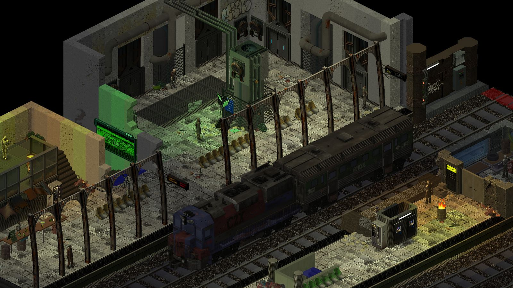
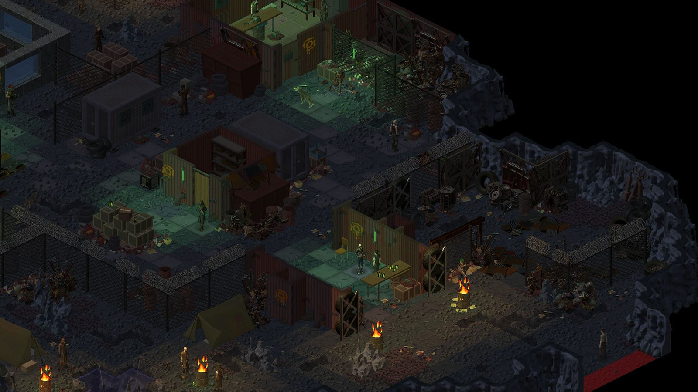
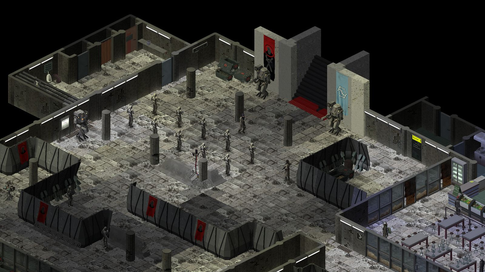
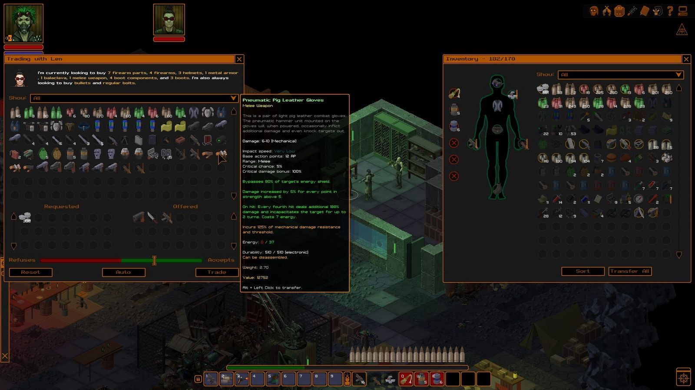
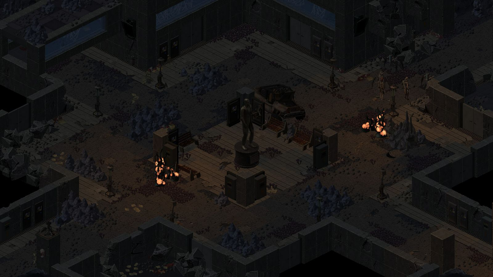
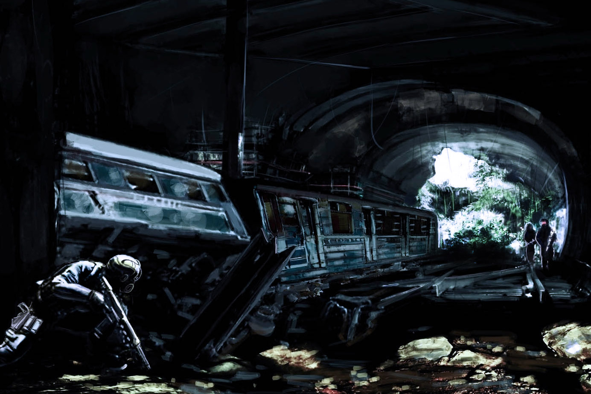

M-am gândit dacă să scriu sau nu un articol despre UnderRail, în primă fază am zis că poate impresia mea despre joc e influențată prea tare de faptul că tocmai îl jucasem, dar au trecut cam trei luni și nu s-a schimbat nimic.

Din 2008 până în 2012 la UnderRail a lucrat predominant o singură persoană, în 2012 a fost lansat ca early-alpha pe diferite platforme digitale de distribuție, iar în 2013 a ajuns și pe Steam early access, pentru ca trei ani mai târziu să scoată în sfârșit capul la iveală și să apară în lista de noi apariții. Descriu traseul jocului pentru că UnderRail reprezintă exemplul perfect, doar faptul că există demonstrează importanță metodelor alternative de finanțare și arată că ocazional pot scoate la iveală giganți.

Cei 6 ani de dezvoltare au fost investiți într-un RPG izometric pe ture, ce se desfășoară într-o lume post-apocaliptică care va duce fanii genului cu gândul la Fallout. Nimic neobișnuit, nu e primul RPG indie care se inspiră din clasici, Spiderweb Sofware au scos destul de multe și un pasionat ar putea să-și ocupe viața doar cu jocurile lor. Însă puțini producători au reușit să transforme chiar rețeta clasică într-un mod inspirat, exemplele grele în acest sens fiind Pillars of Eternity și Divinity: Original Sin. Deși diametral opuse ca filozofie de joc (dialog vs. explorare) ambele au fost o încercare de a recombina elemente deja existente în ceva nou. UnderRail se situează undeva între cele două, pune îndeajuns de mult accent pe dialoguri și poveste (sau povești) cât să nu fie un dungeon crawler dar în același timp explorarea joacă un rol central și nu prea poate fi catalogat ca un RPG axat pe dialoguri.

Există totuși o diferență majoră, așa cum voi descrie pe parcursul acestei semi-recenzii. Cu toate că am trecut prin destul de multe, cu greu îmi vine minte un alt RPG în care producătorii să fie atât de prinși în ceea ce vor să realizeze încât rezultatul final să fie un joc la care trebuie tu să te conformezi, să-l înțelegi și să-l îmblânzești. Dacă Obsidian au ales calea celor mulți, cu un gameplay care permite parcurgerea jocului cu orice clasă sau combinație de abilități și atribute, UnderRail îți oferă o gamă extrem de largă de personaje viabile dar în același timp te lasă să te spânzuri cu propria frânghie când greșești. Nu e un joc accesibil, nu te acomodează și nici nu e interesat de frustrările pe care le vei avea. Dacă aveți impresia că doar jocurile ce vă stimulează reflexele pot fi dificile, veți rămâne întâi surprinși, apoi veți da în depresie.

Am menționat și Divinity pentru că la nivel de gameplay e poate cel mai apropiat de UnderRail. Sigur, aș putea zice că sistemul de reguli amintește de SPECIAL, dar sincer aș putea la fel de bine să înșir pe două rânduri toate jocurile din care am perceput eu că se inspiră UnderRail. În ciuda aparențelor, Fallout e doar una dintre rudele sale Îndepărtate. Divinity: Original Sin în schimb, a reușit să aducă la un nou nivel gameplay-ul pe ture din RPG-urile clasice, l-a făcut mai distractiv și incredibil de variat celor dispuși să experimenteze. Cam asta face și UnderRail.

Concret vorbind și fără să intru prea mult în detalii, sistemul de reguli e flexibil, fără clase, cu scoruri pentru abilitățile de bază, cele secundare și feat-uri. De-aici începe nebunia, abilitățile de bază influențează abilitățile secundare și pot fi necesare pentru a realiza cu succes anumite acțiuni din joc, abilitățile secundare afectează jocul atât în mod direct, prin dialoguri și acțiuni speciale, dar și eficiența în utilizarea armelor sau abilităților ”psionice”, cuvânt a cărui echivalent în română nu îl știu dar echivalentul RPGistic e reprezentat de magie. Feat-urile… fac ce fac feat-urile de obicei, în era FPS/RPG-urilor și a RTS/RPG-urilor sunt termeni arhi-folosiți.

Evident, acesta e un rezumat foarte rudimentar pentru sistemul de reguli, dar vreau să subliniez că nu există o cale dreaptă de a trece prin joc. Nu contează ce combinații de abilități alegi cât timp supraviețuiești în UnderRail, dar pentru binele vostru, v-aș sfătui să nu combinați prea multe. Alternativ, pentru cei mai puțin cicatrizați de RPG-uri, există diferite ghiduri online care descriu ce ar trebui ales pentru construirea unui personaj care să reziste pe parcursul jocului. Deși această cale elimină o parte din frustrări, elimină și experimentarea și satisfacția pe care o ai când realizezi că ai ales corect cum să crești în nivel și că acum te poți plimba fără teamă prin tunelurile abandonate și întunecate pe care le evitai înainte. Cel puțin până în ultimul sfert din joc, dar o să vorbim și despre asta mai încolo.

OK, cred că am schițat cât de cât elementele de bază ce țin de construcția personajului. Cam așa e și cu tutorialul din UnderRail. Tragi cu un pistol, abuzezi de niște roboței, apoi primești aprobarea și devii un cetățean de drept al stației South Gate Station. Nu primești prea multe informații: oamenii trăiesc sub pământ, din varii motive la suprafața e de rău, iar lumea s-a organizat în jurul stațiilor de metrou. Unele de dimensiunea unui sat, altele mai mari. Geografic vorbind, SGS e în sudul sudului, un loc destul de nasol și după standarde post-apocaliptice aparent. După o scurtă întâlnire cu cel de la conducerea stației ești trimis în tuneluri să dovedești și tu că ești bun de ceva. Ca în orice RPG care se respectă, pierzi vreo 4-5 ore la adăpostul primei locații, afli ce se mai întâmplă prin lume și de preferat te echipezi puțin înainte să ieși în tuneluri și în funcție de cum ți-ai investit punctele să fi făcut terci de primul șobolan în rânduri repetate. Ce devine imediat evident (pe lângă absența unei hărți) e că UnderRail pune accent pe atmosferă și explorare, prima ieșire din confortul stației poate trezi amintiri nostalgice din Fallout, iar explorarea unor adăposturi abandonate de ceva vreme, pe fondul coloanei sonore apăsătoare cu siguranță va stimula fanii peisajelor post-apocaliptice.

Alt lucru ușor de observat e că ai în față un joc în care vei încărca salvări, indiferent dacă ai sau nu un personaj bine construit, în UnderRail se moare. Prima parte a jocului se desfășoară în jurul la SGS, ești expus la mare parte din fauna agresivă pe care o vei întâlni, mai duci un dialog influențat de punctele investite în abilități, nimic ieșit din comun. Tot aici e și punctul în care te familiarizezi cu sistemul de luptă pe ture. Din nou, împrumută idei bune din mai multe jocuri dar seamănă cu cel din Original Sin ca implementare. Cu diferența majoră fiind lipsa unui party, în UnderRail joci doar cu personajul creat de tine și nu poți avea însoțitori de vreun fel. Dar dacă ar fi fost un joc cu însoțitori, puteți paria că nu ar fi existat creștere automată în nivel pentru ei. Nu sunt multe de zis aici, e un sistem de luptă funcțional, distractiv dar nu neapărat revoluționar ca mecanici. Ce îl face însă excepțional e modul în care diferitele abilități și feat-uri îl influențează, sunt diferențe majore în funcție de modul în care ți-ai construit personajul, numărul de inamici cu care te lupți sau terenul, precum și modul în care ți-ai organizat consumabilele. Deși nu e o problema decât în primul sfert de joc, lipsa consumabilelor care regenerează viața sau punctele psi (”mana”) poate duce la situații în care singura soluție e să încarci o salvare din urmă cu vreo câteva salvări sau să exploatezi jocul și să fugi la zona de tranziție între hărți încercând să scapi cu viață. Diferența între “magia” din joc și restul abilităților e cât se poate de tranșantă, unde pentru a lovi cu armele de foc sau săgețile primești un procent de reușită în funcție de abilitățile tale, cu psi lovești tot timpul, dar dezavantajul e că rămâi repede fără puncte psi spre deosebire de gloanțe, iar un personaj axat exclusiv pe psi va fi de tip glass cannon, dai mult, tare și bine, dar și când primești…

Pe lângă armele de distanță și psi, mai ai varianta capcanelor, un personaj axat pe asta va duce la un cu totul alt mod de abordare al confruntărilor și situațiilor de joc. Pentru fanii luptei de aproape, există arme melee precum și, ați ghicit, posibilitatea de a jucat axându-te doar pe asta. În funcție de calea aleasă, ies la iveală tot felul de situații la care nu te-ai fi așteptat și soluții surprinzătoare pentru a câștiga luptele. Iar lucrurile capătă o nouă dimensiune când intră în ecuație și furișatul sau faptul că nu te oprește nimeni să combini cum vrei abilitățile. Prin prisma gameplay-ului, e un joc foarte interesant de rejucat, însă durata mare nu prea permite asta tuturor.

După zona introductivă din jurul SGS, ajungi în sfârșit într-o locație nouă, inamici noi care te termină dintr-o lovitură, misiuni, NPC-uri, tot la ce te-ai aștepta. În acest moment, pe la 20-25 de ore de la început, UnderRail se conturează ca un RPG indie simpatic, dar apoi se întâmplă ceva… 

Vedeți voi, această primă parte a jocului nu reprezintă de fapt decât un tutorial glorificat, menit să reducă din diferitele dureri dorsale ce ar putea fi simțite când jocul se deschide și realizezi că de fapt ai în față un alt tip de animal decât ai fi presupus inițial. Locurile pe care le menționau NPC-urile și credeai că vor rămâne la nivel de mențiuni devin deodată accesibile, întreaga lume din UnderRail devine explorabilă iar jocul se schimbă radical. Acum poți merge oriunde, poți face aproape orice misiune te țin balamalele și punctele de abilitate, dar în afara unor explicații sumare, nu îți zice nimeni cam ce trebuie să faci. Nu e genul de joc unde să ai o idee clară de cine e rău, cine e bun și cui trebuie să-i dai în cap. Mai mult, cele câteva tuneluri în care aveai probleme de orientare se transformă în zeci de tuneluri în care orientarea s-a dus pe apa sâmbetei. Nu știi în ce direcție să o apuci, cu cine să vorbești prima dată și de ce mama naibii te omoară toată lumea cu ușurință. Și scuturile, cum mama lor funcționează scuturile?

Nu vă pot spune ce entuziasmat am fost aici, genul acesta de momente mă fac să tot joc RPG-uri. Și indiferent cât de gamer serios te crezi, UnderRail are tot timpul ceva pentru tine, prin care să te surprindă, să te facă să înjuri sau să te holbezi la peisajele izometrice ce pot deveni hipnotice. Și dacă toate astea nu erau de ajuns, când crezi că în sfârșit ai văzut tot, îți pariezi seara de ieșit cu amicii că nu mai are cu ce să te surprindă, atunci vine peste tine și te lasă mască.

Deschiderea lumii de joc introduce pe lângă noi inamici și noi mecanici. Scuturile din UnderRail sunt o găselniță excelentă și la fel ca restul mecanicilor de joc se integrează natural în gameplay. Fiecare tip de armă sau abilitate ofensivă are o anumită viteză de impact: un ciocan va lovi încet, o armă laser foarte repede, înțelegeți ideea. Un scut are patru tipuri de rezistențe, pentru fiecare viteză de impact, precum și capacitatea maximă a damage-ului pe care îl poate absorbi. Și cu ocazia asta mi-am mai amintit ceva, deși pare o idee bună să joci mai tot jocul cu același echipament, UnderRail nu e atât de unidimensional. În funcție de situație și inamici, echipamentul ar trebui adaptat. Evident, și asta ține de construcția personajului, poate cu un personaj psi când te lupți cu 10 tipi înarmați cu ciocane, faptul că ai o abilitate care îți permite să îi manipulezi și să se omoare între ei rezolvă extrem de rapid lucrurile. Însă cu un personaj axat pe arbalete, care e cu 2 nivele mai mare decât cel psi, confruntarea va fi cvasi-imposibilă fără să apeleze la ceva trucuri. Vedeți voi, în UnderRail oricine poate omorî pe oricine dacă are echipamentul și planul corespunzătoare. Cu un scut foarte rezistent la lovituri de ciocan, capcane și săgeți care paralizează inamicii, s-a schimbat situația. Arta Războiului se aplică de minune în UnderRail, cine atacă primul și știe la ce să se aștepte va câștiga, indiferent de puterea relativă a adversarului. La un moment dat ai ocazia să te lupți într-o arenă, unde teoria asta e demonstrată foarte bine. Cu anumite tipuri de personaj poți câștiga luptele împotriva inamicilor mult mai puternici decât tine, doar prin faptul că reușești să câștigi la scorul de inițiativă de la început și deci să lovești primul, iar pe urmă adversarul nu mai are ce să facă. Kill or be killed.

O altă găselniță a jocului e sistemul de oddities, un mod alternativ de a câștiga experiență și a crește în nivel. Vorbesc de asta abia acum pentru că e cu atât mai important să fie înțeles cât de natural se îmbină cu restul jocului. Deși se poate folosi și sistemul clasic, în care câștigi experiență omorând inamici, Oddity e o mică revoluție care face fiecare aspect al jocului cu atât mai interesant și acaparant. Pe scurt, câștigi experiență și crești în nivel adunând diferite obiecte. Da, atât. Nu contează că le găsești în butoaie sau depozite bine păzite. Să zicem că un os de câine valorează un punct de experiență, poți găsi maxim trei care să conteze la experiența ta. Există mai multe în joc, însă doar cele trei se pun. Poate suna stupid, dar se potrivește atât de bine în joc încât aproape că aș numi asta cea mai importantă adiție la stilul clasic din CRPG-uri. Nu iei experiență decât din misiuni și oddities, iar cum obții aceste obiecte ține exclusiv de tine și de cum ți-ai construit personajul. Poate trebuie să te lupți, poate nu, ideea finală e că fiecare stil de construire al personajului oferă același nivel de experiență dar modul în care o obții diferă radical în funcție de abilitățile pe care le ai la dispoziție. Asta face din UnderRail un joc în care deciziile au consecințe cât se poate de palpabile, fără însă să fie scriptate.

Pe partea de misiuni disponibile lucrurile stau foarte bine. Există evident și misiuni mai puțin importante, de tip ”fetch”, dar în mare parte jocul e împărțit în lanțuri de misiuni care de multe ori ajung să se conecteze în moduri interesante. O misiune primită la început are implicații și în finalul jocului, deși nu e cea principală. Și aici ”sistemul” de decizii și consecințe e puternic, se pot rata lanțuri întregi de misiuni în funcție de alegerile făcute, cel mai des asta se întâmplă când nu faci pe plac facțiunilor din joc. Jucând pe Oddity, dacă ratezi bucăți întregi din joc, poți să recuperezi oricum punctele de experiență prin simplul fapt că explorezi tot, însă ce pierzi odată cu misiunile e informația. Iar informația în UnderRail e o resursă foarte valoroasă, cei care se străduiesc să joace cât mai complet vor afla tot felul de lucruri despre personajele importante, precum și evenimentele care au influențat lumea. Dar și asta se reflectă natural în gameplay, cu un pachet nervos de mușchi vei trece prin joc așa cum te-ai aștepta, fără să afli subtilitățile.

Personajele și dialogurile se situează undeva la mijloc pe axa Baldur’s Gate – Icewind Dale. Există multe situații și dialoguri memorabile, însă asta ține foarte mult de alegerile pe care le faci, e perfect posibil ca NPC-urile care mi s-au părut memorabile să nici nu vă iasă în cale sau să vă ignore. Un moment constant și remarcabil însă, e întâlnirea cu un anumit personaj misterios, care îți dă complet peste cap ideile formate despre poveste până atunci. Nu voi da spoilere, dar trebuie să știți că povestea prinde contur abia în a doua jumătate a jocului, când multe evenimente au sens și înțelegi mai bine motivațiile celor implicați. Ce mi-a plăcut e cum funcționează reputația în joc, nu ai cifre sau grafice care să îți arate, dar prin faptul că ajuți o facțiune, se deblochează moduri noi de rezolvare a misiunilor pe teritoriul lor. Spre exemplu, poate pentru a elibera pe cineva dintr-o închisoare ai nevoie de enorm de multe puncte investite în arta manipulării, dacă aștepți și faci misiunea respectivă după ce te-ai dovedit folositor facțiunii care deține închisoarea, poți cere o favoare și s-a rezolvat. E grozav pentru că nu e nimic artificial, lucrurile astea nu îți apar ca obiective undeva, ține doar de tine și e cât explorezi și experimentezi. Și e mult de experimentat, tot relativ la misiunea menționată mai sus, să zicem că nu ajungi la calea lipsită de efort, ce faci atunci? Poate alegi să-l scoți pe nefericit de la răcoare într-un mod subtil, care nu atrage atenția, dar atunci trebuie să neutralizezi paznicul care privește monitoarele de supraveghere, dacă nu faci asta cei din închisoare vor deveni ostili. Dar stai, acum că au devenit ostili, dacă nu îi omori pe toți va afla facțiunea despre ce ai făcut acolo și uite așa ți-ai blocat o zonă din joc.

Naturalețea din gameplay se regăsește de asemenea în design-ul lumii înconjurătoare și al comerțului. Nu e evident decât după multe ore de explorare, dar hărțile sunt gândite cu noimă, locurile în care întâlnești NPC-uri, depozitele abandonate, faptul că există curent în laboratoare de mult uitate, aproape toate au explicații ce pot fi deduse. E un joc care știe cum să-ți povestească ceva doar prin mediu, ceea ce are o sinergie nemaipomenită cu Oddity. Și să nu aveți impresia că grafica 2D îl limitează prea tare, combinația de efecte simple vizuale (tremurarea ecranului) și efecte sonore care aduc aminte de filmele lui Hitchcock fac din UnderRail o experiența mai multidimensională decât credeam posibil la început. Misterul e excelent tratat în joc, descoperirea unei facțiuni ascunse și mai ales a bazei acestei facțiuni e un moment care ar putea să intre într-un hall of fame al jocurilor.

Comerțul și meșteșugăria reprezintă un alt aspect în care UnderRail excelează și redefinește puțin elementele clasice genului. Fiecare comerciant din joc are produse pe care le acceptă și produse de care nu are nevoie, nu poți vinde mitralierele la brutărie. Dar și comercianții de arme au la un anumit moment cerere doar pentru un număr fix de mitraliere, deci nu poți exploata jocul cu drumuri du-te-vino la vânzători. Asta nu face UnderRail imun la punctul de rupere din RPG-uri, când inevitabil ajungi să ai mai mulți bani decât ai nevoie, doar că amână foarte mult acest moment și îți dă senzația că piața nu e acolo doar ca o scuză pentru a scăpa de loot-ul baban pe care îl cari cu tine și a-ți elibera inventarul. Crafting-ul e o latură a jocului pe care nu am explorat-o decât superficial, dar e foarte dezvoltată, amatorii Minecraft au cu ce să-și ocupe timpul. Există foarte multe tipuri de materiale ce se pot combina liber pentru obținerea unui echipament superior. Cred că dezvoltarea unui personaj pe această cale poate duce la un plus considerabil de putere, pentru că echipamentul ce îl poți construi poate fi mult mai puternic decât cel pe care îl găsești de cumpărat. Dezavantajul e că asta implică chiar mai multă dedicație, răbdare și experimentare. Pentru cei mai leneși însă, un mic indiciu, există personaje în joc echipate foarte bine...

Cam acesta e UnderRail în primele trei sferturi de joc, un RPG în stil clasic care reușește să te surprindă și să reîmprospăteze rețeta, dar și un joc dificil, egoist, care îți pune răbdarea la încercare. Dar stați că mai e. Urmează ultimul cui din sicriu, momentul în care mi-am dat jos proverbiala pălărie. După vreo 80-90 de ore de festival RPGistic, ajungi în sfârșit să crezi că ești ”acolo”. Știți voi, momentul acela când ești bazat, îi bați și pe ăia slabi și pe ăia puternici, urmează partea de final a jocului în care dai cu bestia de pământ și (dacă e un joc Bioware) primești și o partidă de sex stânjenitoare în celebrare. Ce primești însă în UnderRail? Primești Deep Caverns.

Cine a jucat Gothic știe momentul, auzi despre zonele periculoase de la oameni, te riști și te duci în zonele periculoase apoi îți iei un viol care te face să-ți reevaluezi viața. Asta e Deep Caverns, un loc în care vei fi manipulat și dus la limita răbdării. Tot ce auzi despre acest loc, ce reprezintă și cât de necruțător e, se va reflecta în mod direct prin gameplay. Dacă ai fost genul care nu a dispus de răbdarea necesară pentru construirea personajului, aici e locul în care vei plânge. Dacă ai avut nevoie de un walktrough ca să termini Monkey Island… da, cam până aici a fost.

În primul rând Deep Caverns e cea mai atmosferică locație din joc, contrastul dintre tunelurile de peșteră claustrofobice pe care le-ai explorat 80 de ore și cavernele gigantice din Deep Caverns m-a făcut să-mi belesc ochii de uimire. Coloana sonoră, locurile individuale pe care le explorezi și te fac să te întrebi ce s-a întâmplat – iar în funcție de cum joci, te vei mai întreba asta și după ce ai terminat jocul - precum și absența NPC-urilor de genul celor cu care te-ai obișnuit, lucrurile astea contribuie la atmosfera apăsătoare de-aici. Dar dificultatea? Ei bine, dificultatea vine sub toate formele posibile. Ai poate un moment tip puzzle până aici pe întreg parcursul jocului, dar de-aici până la final ai puzzle-uri care mi-au amintit de un templu dubios din Realms of Arkania de care nu am trecut vreodată . Dacă nu faci power gaming cu un personaj extrem de puternic, în Deep Caverns vei avea într-o formă sau alta probleme. Joci cu un lunetist excelent? Nu-i nimic, aici dai de inamici care apar doar când ai ajuns lângă ei. Ai extrem de multe puncte de viața? E ok, ia penalitățile astea de -70% la punctele de viață. De fapt, până în Deep Caverns nu există o altă locație cu penalități active, aici se întâmplă asta. Și se întâmplă într-un mod perfect justificat de poveste. Dar puzzle-urile? Aici e problema mare domnilor.

Marile rele momente din aventuri ar rămâne rușinate de ce se întâmplă aici. Sigur, e cu două tăișuri, mulți nu vor avea răbdarea necesară și vor considera ca fiind stupid modul în care un simplu puzzle de redirecționat energia unei centrale electrice poate duce la peste 10 ore de plimbat fără scop, dar e chiar mai rău de-atât, pentru că e plimbat fără rost în singurul loc din tot jocul unde respawn-ul inamicilor e o problemă. Ba mai mult, facțiunea care predomină aici poate să îți fie prietenoasă sau nu, dacă ai ghinionul să nu, vei avea cantități industriale de inamici, cu respawn, în condițiile în care tu ești forțat să revizitezi locațiile pentru că nu te-ai prins cum să rezolvi un puzzle. Poate fi extrem de dureros și îi înțeleg perfect pe cei care au abandonat jocul aici. Dar pe mine m-a făcut să bat din palme pentru că exact asta e ideea, Deep Caverns e un loc nasol unde orice scăpare te costă și la naiba de nu se transpune asta perfect în joc. Nu trebuie să-ți zică nimeni, nu ai nevoie de cutscene-uri cât un episod din Game of Thrones, nu, simți pe pilea ta cât de rău e aici și te rogi să scapi naibii odată.

Însă și acest lucru te poate costa, dacă te grăbești și sari peste un anumit puzzle pe ideea că merge oricum și arăți tu cine-i șeful boss-ului cel mare și rău… șervețele, lacrimi și trezit vecinii cu înjurături. Lupta finală din UnderRail e la fel ca restul jocului, poate fi ușoară, grea sau imposibilă pentru că boss-ului final nu-i pasă de tine și ce poți face.

Ar mai trebui să zic că producătorul promite un expansion major și poate o continuare, sper să fie așa și le aștept cu nerăbdare, dar UnderRail e genul de experiență greu de repetat. O combinație de elemente care au ieșit exact așa cum trebuie, în mare parte intenționat dar și cu o doză de întâmplare, e greu de crezut că într-un eventual UnderRail 2 ar mai reuși asta.

În încheiere, poate că problema lui UnderRail este că e un joc opac. E o realizare de excepție care scoate tot ce e mai bun în față atât din genul din care face parte dar și din modul în care a fost efectiv dezvoltat, fără distragerile industriei AAA. Dar pe cât e de impresionant pe atât de greu e de văzut, nu vreau să intru acum în polemici cu privire la ce ar trebui să fie un joc, pot spune însă că pentru mine UnderRail e exact ceea ce ar trebui să fie un joc. A fost o potrivire aproape divină, nici mie nu-mi venea să cred cât de mult îmi place când îl jucam și cum reușea să mă impresioneze când credeam că nu mai poate să facă asta. Nu cred că a existat alt moment când expresia „instant classic” s-a potrivit atât de bine. ■